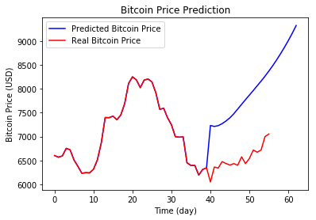

# Archival Repo
The project is live at https://colab.research.google.com/drive/1X9cC7rSrohFwNjjZP1j0n3ADzEiW9Cbn

# Feedback-Loop Bitcoin Forecast

This is an LSTM ANN for forecasting price data (not just bitcoin, but I'm using bitcoin for this example). Built using Keras and read data in chunks so it's able to handle large dataset.

### Feedback loop?
Common example found online is using the existing data for the forecast, i.e. suppose there are :
- 1000 row
- the test split is 0.2
- Batch size is 1
- timestep size is 10

The first iteration of testing (using row 789 through 799, to predict row 800) went normaly, 
but the second iteration (using row 790 through 800, to predict row 801), the row 800 used is not the one produced by the first iteration, but the one provided by the data. So the prediction is not pure.  

By feedback-loop, I mean generating data from itself, i.e. using row 800 predicted by the model for the second iteration

# Author 
Senapati Sang Diwangkara
